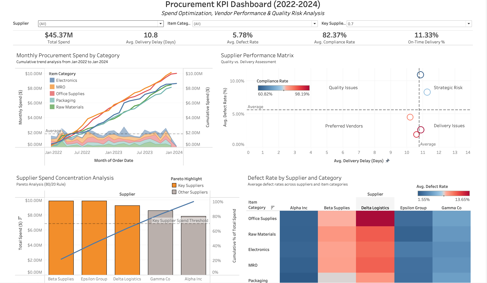

# Procurement KPI Dashboard (2022-2024)

An interactive Tableau dashboard built to analyze procurement performance across supplier delivery, defect rates, and compliance. Designed for supply chain analysts, operations managers, and data teams to optimize vendor selection, reduce risk, and cut costs.

---

---
## Project Overview

### ✅ **Key Features**

- **Dynamic Filters**: Slice data by supplier or item category
- **KPI Metrics**: Total Spend, Avg. Delivery Delay, Defect Rate, Compliance Rate, On-Time Delivery %
- **Supplier Performance Matrix**: Quadrant chart to assess quality and delivery risks
- **Pareto Analysis**: Visualizes spend concentration among top vendors (80/20 rule)
- **Defect Heatmap**: Highlights quality issues by supplier and category
- **Time Trend**: Tracks monthly spend growth by item category

### 📊 **Dataset Summary**

**Source**: Synthetic dataset of ~700 anonymized purchase orders from Jan 2022 to Jan 2024.

- `Delivery_Delay_Days`: Days between expected and actual delivery  
- `Defect_Rate`: Defective units as a percentage of total quantity  
- `Compliance`: Binary flag indicating process adherence  

---

## 🛠️ Tech Stack
- **Programming Language**: Python
- **Data Processing**: Pandas, NumPy
- **Visualization**: Tableau Public

---

## 🔍 Insights

- Only **11.3%** of orders were delivered on time — major delivery inefficiencies  
- **5.78% average defect rate**, with specific suppliers exceeding **13%**  
- Top 3 vendors account for **80% of total spend**, revealing heavy concentration risk  
- Suppliers with **low compliance** consistently showed higher defect and delay rates

## 📍 Tableau Dashboard

👉 **Live Dashboard**: [View on Tableau Public](https://public.tableau.com/views/procurementdashboard_17476876103340/Dashboard1?:language=en-US&publish=yes&:sid=&:redirect=auth&:display_count=n&:origin=viz_share_link)  
